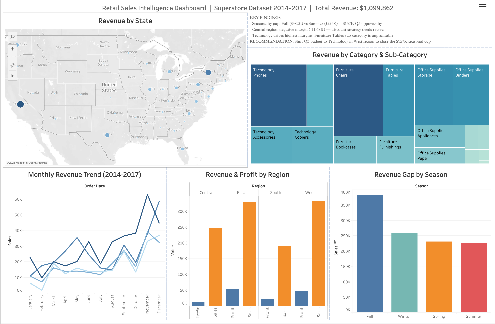

<div align="center">
      
# 📊 Retail Sales Intelligence Dashboard


A production-style retail analytics pipeline built on the public Superstore dataset. Python cleans and enriches 9,994 raw transactions, DuckDB models five analytical KPI views in SQL, and Tableau Public publishes a 5-visual interactive dashboard — all reproducible from a single clone.

</div>

---

## 📸 Dashboard Preview



---

## 💡 Key Findings

| Metric | Value |
|---|---|
| Total Revenue | $1,099,862 |
| Total Profit | $132,515 |
| Avg Profit Margin | 11.95% |
| Avg Fulfillment Time | 4.0 days |
| **Seasonality Gap (Fall vs Summer)** | **$157K** ⚠️ |
| **Central Region Avg Margin** | **-11.68%** ⚠️ |

- **Seasonality gap:** Fall ($382K) consistently outperforms Summer ($225K) by $157K across all four years — a repeatable Q3 demand trough with targeted promotion potential
- **Regional risk:** Central region runs a negative average profit margin driven by over-discounting; East and West both exceed 17% margin
- **Category insight:** Technology carries the highest margins; Furniture (Tables sub-category) is revenue-positive but profit-negative at scale

---

## ✨ Features

| Layer | What it does |
|---|---|
| Python ETL | Loads raw CSV, standardizes column names, parses dates, deduplicates on `order_id`, engineers 8 new columns |
| DuckDB SQL | Creates 5 analytical KPI views in a persistent `.duckdb` file; exports each view to CSV |
| Tableau Dashboard | 5-page interactive dashboard — map, trend line, treemap, seasonal bar chart, regional comparison |
| Reproducibility | Single `clean.py` + `build_model.py` run regenerates everything from the raw CSV |

---

## 🏗️ Architecture

```
Raw CSV (9,994 rows)
      │
      ▼
 clean.py              ← pandas ETL: clean, type-cast, feature-engineer 8 columns
      │
      ▼
superstore_clean.csv   ← 5,009 deduplicated rows
      │
      ▼
 build_model.py        ← DuckDB runner executes sql/model.sql
      │
      ▼
 sql/model.sql         ← 5 KPI views (fact + dimension style)
      │
      ▼
 output/kpis/          ← one CSV per KPI view
      │
      ▼
 Tableau Public        ← 5-page interactive dashboard
```

---

## 📁 Project Structure

```
retail-dashboard/
├── clean.py                    # ETL — cleaning & feature engineering
├── build_model.py              # DuckDB SQL model runner
├── dashboard.twb               # Tableau workbook file
├── dashboard_preview.png       # Dashboard screenshot
├── sql/
│   └── model.sql               # 5 analytical KPI views
├── output/
│   ├── superstore_clean.csv    # Cleaned dataset (5,009 rows)
│   └── kpis/
│       ├── kpi_summary.csv
│       ├── kpi_monthly_trend.csv
│       ├── kpi_regional.csv
│       ├── kpi_category.csv
│       └── kpi_seasonality_gap.csv
└── README.md
```

---

## 🗂️ SQL KPI Views

| View | Description |
|---|---|
| `kpi_summary` | Overall totals — revenue, profit, margin, avg ship days |
| `kpi_monthly_trend` | Revenue & profit aggregated by year and month |
| `kpi_regional` | Revenue, profit, margin, and customer count by region |
| `kpi_category` | Revenue breakdown by category and sub-category |
| `kpi_seasonality_gap` | Revenue, AOV, order count, and profit by season |

---

## 🚀 How to Run

**Prerequisites:** Python 3.10+, pip

```bash
# 1. Clone the repo
git clone https://github.com/DeekshithaKalluri/retail-sales-dashboard.git
cd retail-sales-dashboard

# 2. Set up environment
python -m venv venv
source venv/bin/activate        # Mac/Linux
# venv\Scripts\activate         # Windows

# 3. Install dependencies
pip install pandas duckdb openpyxl

# 4. Download the dataset
# Place "Sample - Superstore.csv" into the data/ folder
# Source: https://www.kaggle.com/datasets/vivek468/superstore-dataset-final

# 5. Run ETL
python clean.py

# 6. Build SQL model and export KPI CSVs
python build_model.py
```

Output CSVs land in `output/kpis/`. Open `output/superstore_clean.csv` in Tableau to rebuild the dashboard.

---

## 🛠️ Tech Stack

| Layer | Tool |
|---|---|
| Language | Python 3.13 |
| Data cleaning | pandas 3.0, numpy |
| SQL engine | DuckDB 1.5 |
| Visualization | Tableau Public |
| Version control | Git / GitHub |

---

## 🧠 Challenges and What I Learned

**Duplicate `order_id` rows** — The raw Superstore CSV contains multiple line items per order (one row per product), causing `order_id` duplicates. Deduplicated using `drop_duplicates(subset="order_id", keep="first")`, reducing 9,994 rows to 5,009 unique orders. An alternative approach would be to aggregate at order level in SQL before exporting.

**DuckDB view alias resolution** — Writing `FROM fact_orders f` and referencing `f.category` caused a `BinderException` because DuckDB resolves column names through its view chain differently than PostgreSQL. Fixed by removing the table alias and referencing columns directly.

**Persistent `.duckdb` file caching** — After fixing the SQL, re-running `build_model.py` still threw the old error because DuckDB had cached the broken view in the `.duckdb` binary. Fixed by deleting the file before re-running to force a clean rebuild.

**Power BI Desktop is Windows-only** — The `.exe` installer cannot run on macOS. Switched to Tableau Public which has a native macOS installer and equivalent visualization capabilities.

**Git divergent branches** — GitHub auto-created a README commit when the repo was initialized, diverging from the local history. Resolved with `git pull --rebase origin main` before pushing.

---

## 📄 Data Source & Attribution

**Dataset:** [Superstore Sales Dataset](https://www.kaggle.com/datasets/vivek468/superstore-dataset-final) by [Vivek468](https://www.kaggle.com/vivek468) on Kaggle.

This is a widely used public dataset originally derived from Tableau's Sample Superstore data. It is used here strictly for educational and portfolio purposes. No modifications have been made to the raw source file — all transformations are documented in `clean.py` and `sql/model.sql`.

**Libraries used:**
- [pandas](https://pandas.pydata.org/) — BSD 3-Clause License
- [DuckDB](https://duckdb.org/) — MIT License
- [Tableau Public](https://public.tableau.com/) — Free tier, Tableau Software LLC

---

## 📄 License

MIT — see [LICENSE](LICENSE)

---

## 👤 Author

**Deekshitha Kalluri** — [GitHub](https://github.com/DeekshithaKalluri)
